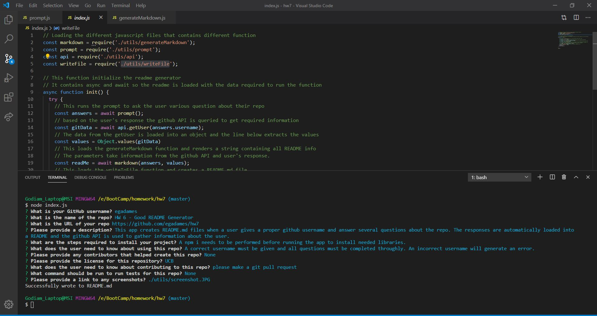

# HW 6 - Good README Generator

  * Created by Kire Semada

  * Github Repo Link: https://github.com/egadames/hw7

## Description 

  * This app creates README.md files when a user gives a proper github username and answer several questions about the repo. The responses are automatically loaded intoa README and the github API is used to gather information about the user.

## Table of Contents 

* [Installation](#installation)
* [Usage](#usage)
* [Credits](#credits)
* [License](#license)
* [Contributing](#contributing)
* [Tests](#tests)
* [Question](#question)

## Installation

  * A npm i needs to be performed before running the app to install needed libraries.

## Usage 

  * A correct username must be given and all questions must be completed throughly. An incorrect username will generate an error.

## Credits

  * None

## License

## Contributing

  * please make a git pull request

## Tests

  * None

## Screenshots

## Questions

  * If there are any questions, please contact via the information below:

  * User GitHub email

    * Email: egadames990@gmail.com
  
  * User GitHub profile picture

  
